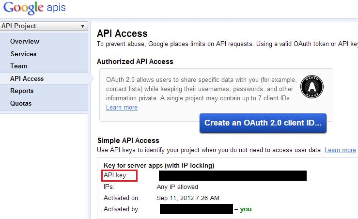

Spring Integration Extension for Push Notifications
====================================================

Introduction
------------
The primary intent of this extension is to provide support in spring integration to enable java applications send push notifications to mobile/handheld devices.

We will support push notifications to Android and iOS devices as part of this extension. The initial phase adds support for Android
devices with the next phase providing support for iOS devices.

To enable us to send push notifications to these devices we use the services provided by Google and Apple for Android and iOS devices respectively. Visit the below links for more information on these services

 - [GCM] Google Cloud Messaging
 - [APNS] Apple Push Notification Service

A Bit about Push notification
-------------------------------
We want to know when an interesting event has happened on a remote location, say a server application.
There are two ways to achieve this

- Pull mechanism
- Push mechanism

In the Pull approach the handheld device continuously polls to check if the event of its interest has happened.
This has two disadvantages

1. It will unnecessarily send requests to the server to check for updates increasing the network usage and traffic. It could also overwhelm the server when many handheld/mobile devices continuously send requests to it.
2. This polling means that handheld device cannot be put to sleep and the application needs to run periodically reducing the battery life of the device which is crucial.

An alternative approach to this problem is the push notification, which is similar to the Observer Design Pattern which notifies the listener when an event of it's registered interest has occurred. This addresses both the issues we discussed with the pull approach,
but it now introduces a service in between which interacts with the handheld devices for pushing the notifications to them and receiving the notifications to be pushed from the java application.
The server application never interacts with the handheld device
directly as far as the push is concerned (*the handheld device however might for some activity as we shall see in subsequent sections*)

Push to Android Devices
-------------------------

Android is a Linux based operating system primarily for touch screen devices.
We won't delve into the details of Android OS here as it is out of our scope.
We however do recommend you know the basics concepts of Android Operating system and application development in Android as that would come handy when you run the sample application using the emulator from Android SDK. We shall give steps to setup and get the application running though.
The [Android development guide] is the ultimate reference but can be a bit time consuming to go though it if you just need to get a feel of the Android program and run it.
[Lars Vogel's] tutorial is good enough to start off with.

To start using Google Cloud Messaging (GCM), you need to enable the service in your Google APIs. Look at the [Getting Started] section of the GCM to know how to create your Google API account and enable the GCM service.
Once you are done enabling the GCMservice we are good to go ahead
with the architecture after we introduce some terminologies here

 - ***Sender Id***
		This is the project id of your Google API Account, this will be unique across and no other user will receive
		this project id.

 - ***Application Server***
		The server side application which is interested in notifying the handheld devices of an event that has occurred.

 - ***Mobile/Handheld Device***
		The handheld Android based device that would be receiving the push notifications about the events those have happened on the Application server.

 - ***GCM Servers/Service***
		The servers managed by Google that would taking the message from the application server and be pushing to the mobile device.

 - ***Sender's Token***
		This is the token that was generated when you saw the *Getting Started* section above followed it completely to setup your account.
		This id will be sent from the application server using the spring integration extension to the GCM servers with the push request.

 - ***Registration ID***
		This is the unique registration id of the Android device with the GCM Servers.
		This id is then passed on by the device to the application server which is then sent by the server in its request for pushing messages to the devices to the GCM.
		As far as the push mechanism is concerned, the only time the device directly interacts with the server directly is when it wants to give the registration id.

Now we get on with the typical architecture and flow of the push messaging.

The below diagram shows the high level interaction of the components
involved in the push messaging.

 Flow")

We will elaborate the steps below and also mention whose scope the step
lies in

<table width="100%" border="1">
	<th width="10%">Step</th>
	<th width="70%">Step Description</th>
	<th>Scope</th>

	<tr>
		<td>1</td>
		<td>
			Send a request to GCM services to register the device, the registration request includes the Sender Id (see above for what a Sender Id is)
		</td>
		<td>
			Mobile Device/Application
		</td>
	</tr>
	<tr>
		<td>2</td>
		<td>
			Receive the request from the mobile device, register it and return the Registration ID to mobile device. This id uniquely identifies the device on the GCM servers.
			<i><b>It is important to note that the GCM Service periodically changes the Registration Ids of the devices and as a result it will push the Registration Ids to the Mobile device even if it has not requested a registration.</b></i>
		</td>
		<td>
			GCM Service
		</td>
	</tr>
	<tr>
		<td>3</td>
		<td>
			Send the Registration ID to the Application server. This can be done using a simple HTTP call or opening a socket connection and sending the raw bytes using a predetermined protocol between the server and the mobile application.
			Please note that since the GCM Service can send the new Registration Id to the Mobile device asynchronously, the Mobile application needs to send the new Registration id to the Application Server.
		</td>
		<td>
			Mobile Device/Application
		</td>
	</tr>
	<tr>
		<td>4</td>
		<td>
			Receive the Registration Id sent from the mobile application and store it in an application specific data store, typically a database.
		</td>
		<td>
			Application Server
		</td>
	</tr>
	<tr>
		<td>5</td>
		<td>
			Send the push notification request to the GCM servers,
			 this request includes the Registration Ids of the devices to which the data is to be pushed, the text string that represents the data to be pushed and other configuration attributes defined by GCM service. We will discuss these attributes and their significance later.
		</td>
		<td>
			Application Server
		</td>
	</tr>
	<tr>
		<td>6</td>
		<td>
			Parse the request from the Application Server and push/schedule to push to the Mobile Device/Application.
		</td>
		<td>
			GCM Service
		</td>
	</tr>
	<tr>
		<td>7</td>
		<td>
			Acknowledge the request with a response containing some predetermined attributes and their values.
			These attributes and the possible values will be explained in later sections.
		</td>
		<td>
			GCM Service
		</td>
	</tr>
	<tr>
		<td>8</td>
		<td>
			Read the response from the GCM servers and take appropriate actions. Store the relevant attributes in the response in the data store discarding the rest.
		</td>
		<td>
			Application Server
		</td>
	</tr>
	<tr>
		<td>9</td>
		<td>
			Receive the push from the GCM Servers and execute the logic in the application for an action to be taken.
		</td>
		<td>
			Mobile Device/Application
		</td>
	</tr>
</table>

In the above sequence of actions, step 1 to 4 happens only when the devices receives a registration id. All other steps 5 - 9 happens everytime the Application Server sends a push notification request.

Where Does Spring Integration fit in the above steps?
------------------------------------------------------

Spring Integration will be used in all the steps where the scope is ***Application Server***.

This particular module for push notification along with other Spring Integration adapters together can be used to implement the the Application Server functionality.

For example, to implement the step 4 we can use the HTTP or the TCP/UDP inbound adapter/gateway support of spring integration to receive the Registration Id from the Mobile device. Upon receiving the ID we can use the JDBC or JPA support(Spring Integration version 2.2 and above) to store the data in a relational database. Adapters for other NoSQL solutions like Mongo DB and Redis is also available starting Spring Integration 2.2. These too can be used to store the Registration ids of the devices.

For step 5 we will be using the push notification gateway to GCM Services. The details about this adapter, the important classes, the request message format, various attributes in the request and response will be explained in later sections in details.

For step 8, the push notification gateway for GCM will return an object containing various response parameters from the GCM Service. The possible values and their meaning will be explained in later section. The application is now responsible to read the response values and store the relevant ones in the datastore using any of the adapters we have used in step 4 to interact with the underlying datastore.

Visit the [Spring Integration Documentation] for more details on these adapters
(Note: This is currently 2.1.x, will have 2.2.x and above here once 2.2 goes GA)

For sake of simplicity, we haven't implemented all the steps in our sample application.
Since our focus is on sending and receiving the push notifications, we will be copying the Registration Id of the device to which we will be sending the push notification manually in the sample application that would be sending the push notification (rather than letting the mobile application sending it to the server over TCP/UDP or HTTP request).

Having said that, let us look at the important classes and interfaces of the library

Important classes and interfaces of the push notification library
------------------------------------------------------------------

For all the class names, *o.s.i.p* is used as the shortened version of *org.springframework.integration.pushnotify*

1. *o.s.i.p.PushResponse* Implemented by the classes that contain the response of the push. It just defines one method, *isMulticast* to indicate if the push was for multiple devices or a single device.
2. *o.s.i.p.PushNotifyService*
This is the core interface that defines one method *push* that returns an instance of *o.s.i.p.PushResponse*. The *push* method accepts three parameters

- A Map with String key and values for the data that needs to be pushed. The data is always sent in key value pair. The accepted type of the value is dependent on the particular service implementation.
- A Map of attributes as String key value pair, these are the attributes that are specific to the implementation which may affect the behavior of the push messaging.
- A var args parameter, that contains the String values which are the identifiers of the mobile device to which the push is to be sent.
This value should be recognized by the service provider of push messaging.
3. *o.s.i.p.AbstractPushNotifyService* This is the generic service that is to be extended by all the specific implementations of the push messaging. It implements *o.s.i.p.PushNotifyService*.
This class defines one abstract method *doPush* which is expected to be implemented by the specific implementation. If this method returns *null*, it is assumed that the message sending has failed and needs to be retried. If retries are enabled, [exponential backoff] approach is used for retrying upto the configured maximum time for retry.
4. *o.s.i.p.gcm.GCMPushNotifyService*
This is the core interface that extends *org.springframework.integration.pushnotify.PushNotifyService* interface.
This interface does not define any additional methods but only some constants which are relevant to GCM push messaging.
5. *o.s.i.p.gcm.GCMPushResponse* It extends from *o.s.i.p.PushResponse* and provides the caller who invoked the push with information returned from the GCM servers. It defines the below methods.
- *getResponseCode()* The HTTP response code for the push request. Possible response code are 200 (successful), 400 (bad request, containing invalid fields etc), 401 (authentication error), 500(internal error) and 503 (temporarily unavailable).
- *getErrorCodes()* The error codes if the response is other than 200 or 503. The value is a Map with the receiver id as a String and the value is the error code returned by GCM.
- *getSentMessageIds()* Identifiers from the server acknowledging the receipt of the message sent.
The Map contains the key which is the Receiver Id provided and the value is the message id received from the GCM server.
- *getCanonicalIds()* The Map returning the canonical ids, if any.
This id indicates that the device to which the message was sent has a new Registration Id with the server other than the one sent with the request.
The sender should replace the Registration Id of the receiver with this canonical id and use it for any subsequent requests sent to this device.
The key is the original Registration Id sent in the request and the value is the Canonical Id, that is the new Registration Id of the device. The application should check this response and replace the Registration Id it has with the canonical id received in its data store. As GCM will eventually discard the old Registration Id, all requests containing the old id will start failing.
- *getSuccessfulMessages()* The number of successful pushes from the provided number of Registration Ids
- *getFailedMessages()* Gets the number of messages which failed to execute a push to the remote device.
- *getNumberOfCanonicalIds()* Gets the number of canonical ids present in the response.
This will be same as the size of the map returned by *getCanonicalIds()*.
- *getMulticastId()* Gets an id representing the multicast id, if the request was to push to multiple Registration Ids.

6. *o.s.i.p.gcm.GCMPushNotifyServiceImpl* The implementation class for the GCM Push messaging.
It extends from *o.s.i.p.AbstractPushNotifyService* and implements *o.s.i.p.gcm.GCMPushNotifyService* interface. The result of push is an instance of *o.s.i.p.gcm.GCMPushResponse*.
7. *o.s.i.p.gcm.GCMOutboundGateway* The gateway implementation of the GCM. This classes uses *o.s.i.p.gcm.GCMPushNotifyService* to send push notifications.
The response of this gateway is an instance of type *o.s.i.p.gcm.GCMPushResponse*. There are some attributes of this class which we will discuss when we introduce the request attributes to GCM service.

See [GCM Response] for more details about the response received from the GCM service.

Handling the request message
-----------------------------
Now that we have seen the important classes, their purpose and their methods, let us now look at the supported request attributes for GCM and see how the payload of the incoming message handled by the *o.s.i.p.gcm.GCMOutboundGateway* class.

Below table gives us the attributes supported by GCM.

<table border="1">
	<th>
		&nbsp;
	</th>
	<th>
		Attribute
	</th>
	<th>
		Description
	</th>
	<tr>
		<td width="10%">1</td>
		<td width="20%">collapse_key</td>
		<td>
			It is a String value that is used to group a number of messages together.
			It plays a part when the device is offline and the messages are pending to be delivered on the GCM server. Setting the collapse key collapses any message with the same collapse
			key on the server and ensures only the last message gets delivered to the mobile device when it comes online.
		</td>
	</tr>
	<tr>
		<td width="10%">2</td>
		<td width="20%">delay_while_idle</td>
		<td>Indicates that the message should not be delivered when the device is idle and should be delayed till it becomes active. If a collapse key is mentioned, the rule mentioned above will be applied while delivery when the device becomes active.</td>
	</tr>
	<tr>
		<td width="10%">3</td>
		<td width="20%">time_to_live</td>
		<td>Indicates how long in seconds the message is to be kept on GCM servers if the device is offline or non reachable before it is discarded.</td>
	</tr>
</table>

For the above three attributes, the class *o.s.i.p.gcm.GCMOutboundGateway* has three setters, each of type *o.s.expression.Expression*.
If set, they are evaluated with the root object as the incoming message to compute the value of the above three attributes.
Though the attribute type is String, the value of time to live expression be parsable to a Long. The three setters to set these expression are
*setCollapseKeyExpression*, *setDelayWhileIdleExpression* and *setTimeToLiveExpression*.

For the Receiver Ids, there is an expression that can be set in the gateway class using the *setReceiverIdsExpression* expression. This expression is evaluated with root object as the incoming message and the result type can either be a String, in which case it is assumed to be the only receiver id, a String[] representing multiple receiver ids or a Collection of String which again represents multiple receiver ids.

Now for the payload. GCM accepts payload of type Map with key and value both as String types.
Hence the payload of the incoming message to gateway can be of three types.

- Map, in this case the key has to be String and the value has to be String as well.
If the value is not a String, its toString representation is used and sent in the request.
- String, this is straight forward and the payload is sent as the value in the map. The key defaults to value *Data* and can be overridden by invoking the *setDefaultKey* method of the gateway and passing the required default key value.
- Any object, in this case the conversion service is used to convert it to a String if possible.
If it can be, then the converted String value is sent as the value with the *defaultKey* as the key as above.

If none of the above three is possible, then a *o.s.i.MessagingException* is thrown.

Namespace support for push messaging
-------------------------------------
Spring Integration's Push Messaging does provide namespace support similar to other Spring Integration components to abstract the underlying bean instantiation and wiring from the developer.
The developer's work is a simple as defining the xml tags using the namespace support with some predetermined attributes and all the necesary bean instantiation and wiring is done transparantly when the application context comes up.

Below is the sample xml definition for setting up a GCM outbound gateway with all the possible attributes

		<int-pushnotify:outbound-gateway
				id="validOne"
		        type="android"
		        sender-id="abc"
		        collapse-key="ColKey"
				collapse-key-expression="headers['cke']"
				delay-while-idle="true"
		        delay-while-idle-expression="headers['dwi']"
		        time-to-live="10000"
				time-to-live-expression="headers['ttl']"
				receiver-id="1234534"
				receiver-id-expression="headers['recid']"
		        request-channel="requestChannel"
		        reply-channel="replyChannel"/>

The expression and the literal value for each are mutually exclusive to each other.
For e.g. the *collapse-key* and the *collapse-key-expression* are mutually exclusive to each other.
The type attribute is mandatory that identifies the type of the service to push to. Currently *android* is the only value supported.
We have plans to support more services in future.

Executing Testcases
-------------------

All the test cases are present in the src/test/java folder

The three important test cases are

- *OutboundGatewayParserTests*
- *GCMOutboundGatewayTests*
- *GCMPushNotifyServiceImplTests*

Of the above tests, *GCMPushNotifyServiceImplTests* is the test that connects to the GCM servers and tests sending push messages.
This test expects a properties file *services.properties* in the class path with two properties, *senderId* and *receiverId*.
The senderId is is the value of the API Key from your Google API console as seen below

For the receiver id, run the sample and from the emulator register the device as per the teps given in the readme of the sample.
The registration id returned by the GCM server can be used to test the push from the test cases to the android application running on the emulator

[GCM]:http://developer.android.com/guide/google/gcm/index.html
[APNS]:http://developer.apple.com/library/mac/#documentation/NetworkingInternet/Conceptual/RemoteNotificationsPG/ApplePushService/ApplePushService.html
[Android development guide]:http://developer.android.com/guide/components/fundamentals.html
[Lars Vogel's]: http://www.vogella.com/articles/Android/article.html
[Getting Started]:http://developer.android.com/guide/google/gcm/gs.html
[Spring Integration Documentation]:http://static.springsource.org/spring-integration/reference/htmlsingle/
[exponential backoff]:http://en.wikipedia.org/wiki/Exponential_backoff
[GCM Response]: http://developer.android.com/guide/google/gcm/gcm.html#response